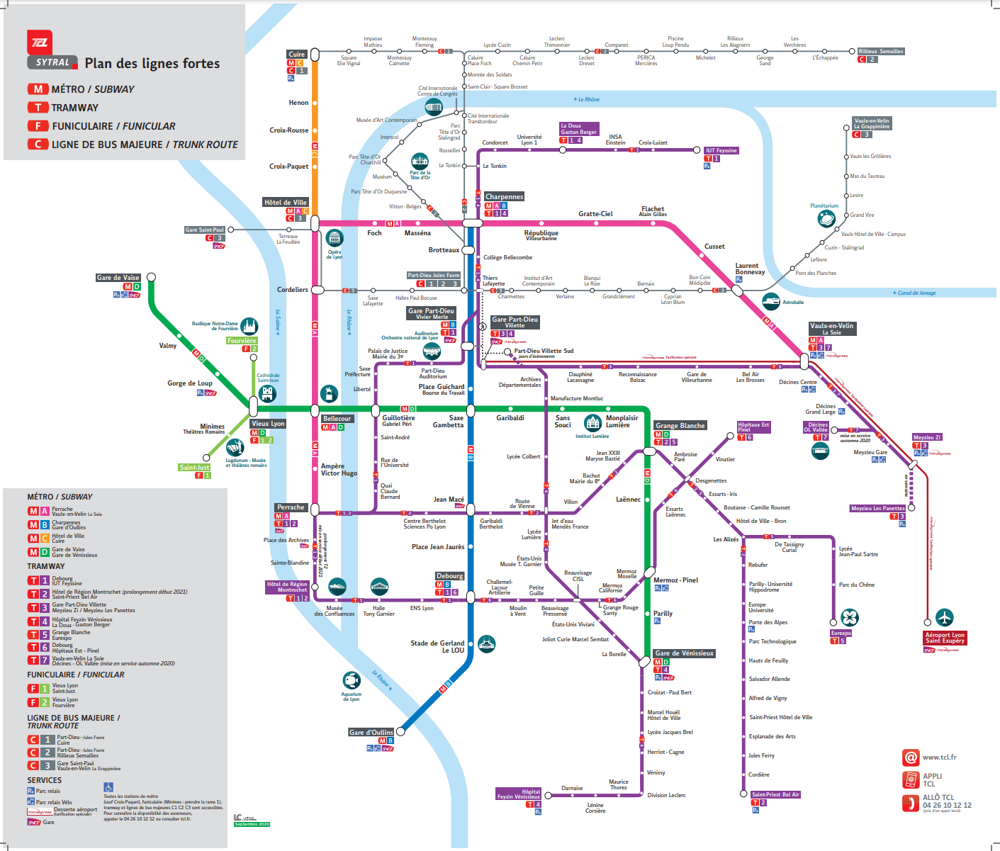

# TP

Pour faire mon TP, je me suis aidé du métro de Lyon. J'ai utilisé les 4 lignes principales (A, B, C, D).
J'ai utilisé uniquement les points principaux (qui doivent être les points d'échanges entre plusieurs lignes. Exemple: Hôtel de Ville) pour faire mon graph.
J'ai utilisé Dijkstra, Prims et Kruskal comme algorithme.



# Lancement de l'executable avec Linux

```sh
go run algo --start="Gare de Vaise" --end="Brotteaux"

output -->
----- Algorithme de Dijkstra -----
Le chemin avec Dijkstra coûte  9
Gare de Vaise  ->  Vieux Lyon  ->  Bellecour  ->  Guillotière  ->  Saxe Gambetta  ->  Gare Part-Dieu  ->  Brotteaux
----- Algorithme de Prims -----
Le chemin avec Prims coûte  9
Départ de Gare de Vaise vers Vieux Lyon avec un poid de 3
Départ de Vieux Lyon vers Bellecour avec un poid de 1
Départ de Bellecour vers Cordeliers avec un poid de 1
Départ de Bellecour vers Guillotière avec un poid de 1
Départ de Cordeliers vers Hôtel de Ville avec un poid de 1
Départ de Guillotière vers Saxe Gambetta avec un poid de 1
Départ de Saxe Gambetta vers Jean Macé avec un poid de 1
----- Algorithme de Kruskal -----
Cordeliers  ->  Bellecour  ==  1
Hôtel de Ville  ->  Cordeliers  ==  1
Vaulx-en-Velin  ->  Laurent Bonnevay  ==  1
Saxe Gambetta  ->  Jean Macé  ==  1
Brotteaux  ->  Gare Part-Dieu  ==  1
Charpennes  ->  Brotteaux  ==  1
Bellecour  ->  Vieux Lyon  ==  1
Le chemin minimum avec Kruskal est de 7

go run algo --start="Hôtel de Ville" --end="Grange Blanche"

output -->
----- Algorithme de Dijkstra -----
Le chemin avec Dijkstra coûte  8
Hôtel de Ville  ->  Cordeliers  ->  Bellecour  ->  Guillotière  ->  Saxe Gambetta  ->  Grange Blanche
----- Algorithme de Prims -----
Le chemin avec Prims coûte  6
Départ de Hôtel de Ville vers Cordeliers avec un poid de 1
Départ de Cordeliers vers Bellecour avec un poid de 1
Départ de Bellecour vers Vieux Lyon avec un poid de 1
Départ de Bellecour vers Guillotière avec un poid de 1
Départ de Guillotière vers Saxe Gambetta avec un poid de 1
Départ de Saxe Gambetta vers Jean Macé avec un poid de 1
----- Algorithme de Kruskal -----
Cordeliers  ->  Bellecour  ==  1
Hôtel de Ville  ->  Cordeliers  ==  1
Vaulx-en-Velin  ->  Laurent Bonnevay  ==  1
Saxe Gambetta  ->  Jean Macé  ==  1
Brotteaux  ->  Gare Part-Dieu  ==  1
Charpennes  ->  Brotteaux  ==  1
Bellecour  ->  Vieux Lyon  ==  1
Le chemin minimum avec Kruskal est de 7
```
